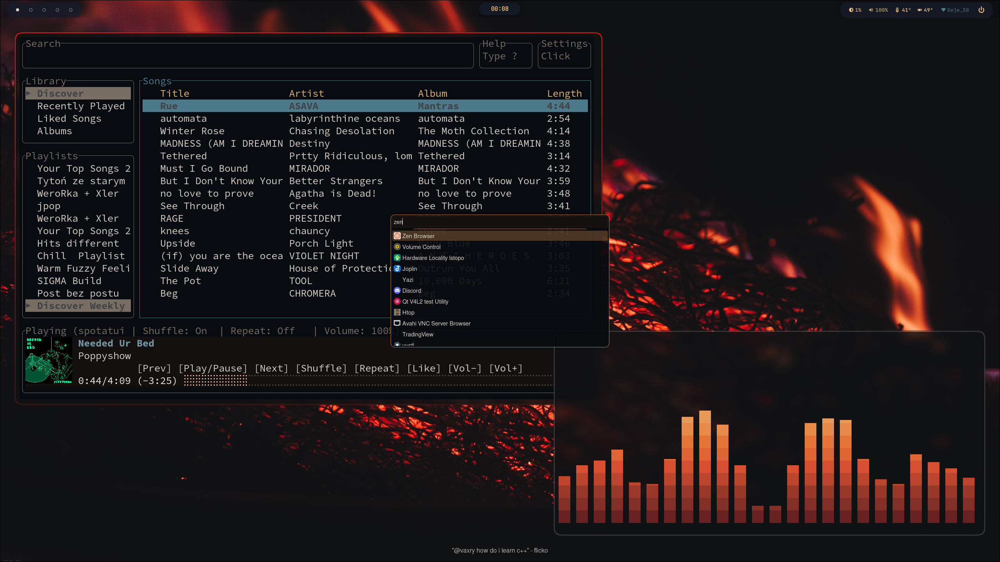
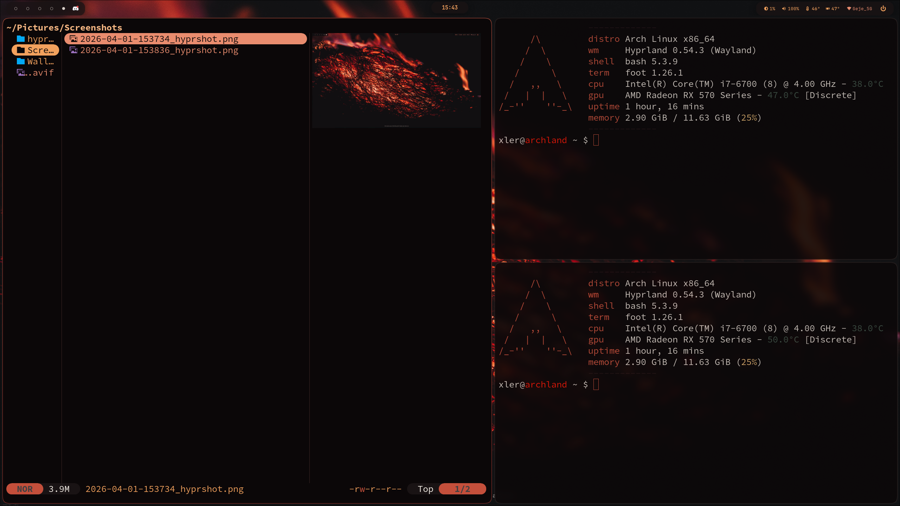

# Dotfiles

My personal Arch Linux + Hyprland setup.

This repository contains my user configs, scripts, package lists, wallpaper, and selected system configuration used to recreate my desktop after a fresh install.

## Preview

### Desktop




## Included

- Hyprland
- Waybar
- Foot
- Fastfetch
- Yazi
- Helix
- Micro
- Cava
- Wlogout
- Zathura
- Btop
- Rustfmt
- LACT (portable UI defaults)
- PupGUI
- Spotatui
- TradingView Desktop flags for remote debugging / MCP tooling
- Bash aliases and shell config
- User systemd services
- greetd config
- GRUB config
- package lists
- wallpaper and sync/deploy scripts

## Sync

To refresh the tracked configs from the current machine state, run:

```bash
./scripts/sync-home.sh
```

The sync step keeps a few files portable on purpose:

- `hypr/.config/hypr/monitor.conf` is rewritten to a generic monitor auto-detect layout.
- `hypr/.config/hypr/hyprpaper.conf` and `pupgui/.config/pupgui/config.ini` render `$HOME` as `@HOME@`.
- `lact/.config/lact/ui.yaml` drops machine-specific GPU IDs and plot bindings.
- `tradingview/.config/tradingview-flags.conf` is copied if `~/.config/tradingview-flags.conf` exists locally.

## Deploy

To install the tracked user dotfiles onto a fresh machine, run:

```bash
./scripts/deploy-home.sh --dry-run
./scripts/deploy-home.sh
```

This copies the user config into `$HOME`, installs the wallpaper used by `hyprpaper`, and renders `@HOME@` placeholders to the current username/home path.

User systemd enablement symlinks are intentionally not tracked, so after deploy you should enable the services you want yourself, for example:

```bash
systemctl --user enable --now audio-sanity.service
systemctl --user enable --now hyprpolkitagent.service
```

## Packages

Base packages live in `packages/official.txt` and `packages/aur.txt`.

Hardware-specific lists are split out so the same repo works on different machines:

- `packages/cpu-intel.txt`
- `packages/cpu-amd.txt`
- `packages/gpu-amd.txt`
- `packages/gpu-nvidia.txt`

For the laptop setup used in this repo, the usual combination is:

```bash
sudo pacman -S --needed $(grep -hvE '^(#|$)' packages/official.txt packages/cpu-intel.txt packages/gpu-nvidia.txt)
paru -S --needed $(grep -hvE '^(#|$)' packages/aur.txt)
```

If the laptop is hybrid Intel + Nvidia and you need Vulkan on the Intel iGPU too, add `vulkan-intel`.
